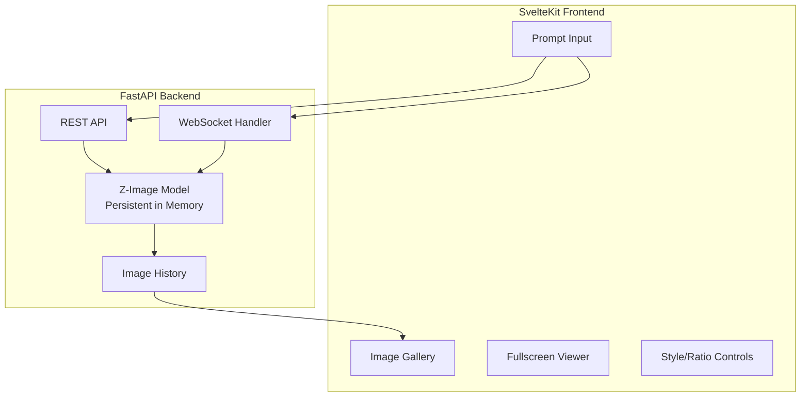

# Z-Image Web Application Implementation Plan

A modern, Krea.ai-inspired web interface for Z-Image generation on Apple M4 Pro with persistent model loading.

## User Review Required

> [!IMPORTANT]
> **Architecture Decision**: FastAPI backend + SvelteKit frontend. Model stays loaded in memory for sub-15s generation after warmup. Is this acceptable, or would you prefer a simpler single-page approach?

> [!IMPORTANT]  
> **16:9 Default**: You mentioned default 16:9 aspect ratio. Standard resolutions would be:
> - **1920×1080** (Full HD) - ~25-35s on M4 Pro
> - **1280×720** (HD) - ~12-18s on M4 Pro
> - **1024×576** (Wide) - ~8-12s on M4 Pro
> Which resolution should be the default for 16:9?

> [!CAUTION]
> **Reference Image Support**: Z-Image-Turbo is a text-to-image model. True image conditioning (like "make me look like an anime character") requires Z-Image-Edit which isn't released yet. We can implement:
> 1. **Image-to-prompt description** (use a vision model to describe the image, then incorporate into prompt)
> 2. **Placeholder for future Z-Image-Edit** when released
> 
> Which approach do you prefer?

---

## Proposed Architecture



---

## Proposed Changes

### Backend Component (FastAPI)

#### [NEW] [server.py](file:///Users/m/Documents/antiGravity/z-image/Z-Image/webapp/backend/server.py)
Main FastAPI application with:
- **Startup event**: Load Z-Image-Turbo once into memory (bfloat16, MPS)
- **POST `/generate`**: Synchronous image generation
- **WebSocket `/ws/generate`**: Real-time progress updates
- **GET `/api/images/{image_id}/download`**: Download image with clean name
- **DELETE `/api/images/{image_id}`**: Delete an image from history and disk
- **GET `/api/check-updates`**: Check HuggingFace for model updates

#### [NEW] [model_manager.py](file:///Users/m/Documents/antiGravity/z-image/Z-Image/webapp/backend/model_manager.py)
Singleton model manager:
- Load model on first request or server start
- Keep components dict in memory
- Handle graceful shutdown
- ~8s startup, then instant for subsequent requests

#### [NEW] [image_store.py](file:///Users/m/Documents/antiGravity/z-image/Z-Image/webapp/backend/image_store.py)
- Store last 20 generated images with metadata
- Persist to `webapp/generated/` directory
- Include prompt, settings, timestamp per image

---

### Frontend Component (SvelteKit)

#### [NEW] [webapp/frontend/](file:///Users/m/Documents/antiGravity/z-image/Z-Image/webapp/frontend/)
SvelteKit project with:

| File | Purpose |
|------|---------|
| `src/routes/+page.svelte` | Main interface with centered prompt input |
| `src/lib/components/ImageGallery.svelte` | Right sidebar with 20 recent images |
| `src/lib/components/FullscreenViewer.svelte` | Modal for viewing/downloading images |
| `src/lib/components/StyleSelector.svelte` | Anime/Realistic toggle |
| `src/lib/components/AspectRatioSelector.svelte` | 16:9, 1:1, 9:16, 4:3 presets |
| `src/lib/components/ReferenceUploader.svelte` | Upload reference images |
| `src/lib/stores/generation.ts` | Svelte store for WebSocket state |

---

### Design Aesthetic (Differentiating from "Vibe" Sites)

Instead of the typical gradient-heavy, glassmorphism-focused AI tool aesthetic, we'll use:

| Element | Our Approach |
|---------|--------------|
| **Color palette** | Warm neutrals + single accent (amber/copper) |
| **Background** | Subtle paper texture, not pure black/white |
| **Typography** | Serif headings (Playfair Display), clean sans body |
| **Animations** | Minimal—purposeful fade/slide only |
| **Layout** | Generous whitespace, editorial magazine feel |
| **Controls** | Understated, almost invisible until hovered |

Think: **Notion meets a photography portfolio**, not Discord/Midjourney.

---

### Themes

We will support three distinct themes:
1. **Studio (Default)**: Warm neutrals, paper texture, elegant serifs.
2. **Midnight**: Dark mode with deep charcoal and subtle amber accents.
3. **Nordic**: Cool grays, minimal sans-serif, inspired by Scandinavian design.

---

### Directory Structure

```
Z-Image/
├── webapp/
│   ├── backend/
│   │   ├── __init__.py
│   │   ├── server.py          # FastAPI app
│   │   ├── model_manager.py   # Persistent model loader
│   │   ├── image_store.py     # History management
│   │   └── requirements.txt   # fastapi, uvicorn, python-multipart
│   ├── frontend/
│   │   ├── src/
│   │   │   ├── routes/
│   │   │   ├── lib/
│   │   │   └── app.css
│   │   ├── package.json
│   │   └── svelte.config.js
│   └── generated/             # Stored images (gitignored)
└── (existing files unchanged)
```

---

## Verification Plan

### Automated Tests

1. **Backend startup test**
   ```bash
   cd webapp/backend
   python -c "from server import app; print('Server imports OK')"
   ```

2. **Model loading test** (takes ~8s first run)
   ```bash
   cd webapp/backend
   python -c "from model_manager import get_model; m = get_model(); print('Model loaded')"
   ```

3. **Frontend build test**
   ```bash
   cd webapp/frontend
   npm run build
   ```

### Manual Verification

1. **Start backend**: `uvicorn webapp.backend.server:app --reload`
2. **Start frontend**: `cd webapp/frontend && npm run dev`
3. **Generate image**: Type prompt, verify image appears in ~15s
4. **Click gallery image**: Should open fullscreen with download button
5. **Delete image**: Delete from fullscreen viewer, verify it disappears from gallery
6. **Switch themes**: Verify colors and typography change across the app
7. **Test aspect ratios**: Switch between 16:9, 1:1, 9:16
8. **Test style toggle**: Anime vs Realistic should prepend style keywords

> [!NOTE]
> No existing tests in this repo. I recommend we add pytest for backend and Playwright for frontend E2E if you want automated browser testing.

---

## Performance Expectations

| Operation | First Run | Subsequent |
|-----------|-----------|------------|
| Server startup | ~8-12s (model load) | <1s |
| 1024×1024 image | ~15s | ~15s |
| 1280×720 image (16:9) | ~12-18s | ~12-18s |
| Gallery update | <100ms | <100ms |

---

## Questions Before Proceeding

1. **Default 16:9 resolution**: 1280×720 (faster) or 1920×1080 (higher quality)?
2. **Reference images**: Implement vision-to-prompt workaround, or skip for now?
3. **Port numbers**: Backend on 8000, Frontend on 5173 OK?
4. **Image persistence**: Keep generated images across server restarts, or session-only?
