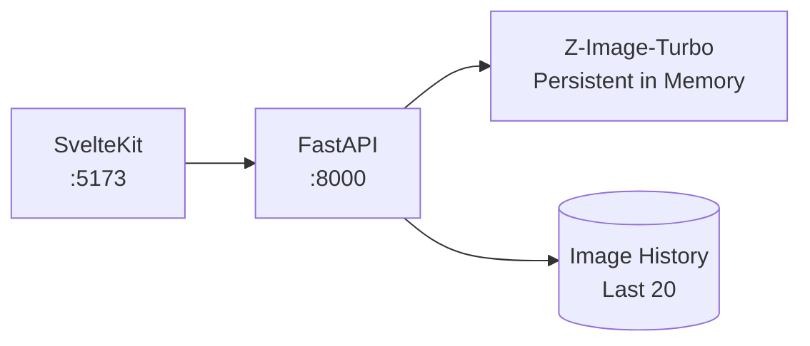

# Z-Image Studio Walkthrough

A Krea.ai-inspired web interface for local image generation using Z-Image-Turbo.

## What Was Built



---

## Quick Start

```bash
# Terminal 1: Start backend (loads model ~8s first run)
cd webapp && ./start-backend.sh

# Terminal 2: Start frontend
cd webapp/frontend && npm run dev
```

Then open **http://localhost:5173**

---

## Features Implemented

| Feature | Status |
|---------|--------|
| Persistent model loading | ✅ No reload between generations |
| Progress Bar | ✅ Real-time denoising updates |
| Generation Timer | ✅ Visible live counter (seconds) |
| Batch Generation | ✅ Create 1, 2, or 4 images at once |
| Image Deletion | ✅ Delete from gallery or viewer |
| Color Themes | ✅ Studio, Midnight (Dark), Nordic |
| Quality presets | ✅ Draft, Standard, High, Ultra |
| Aspect ratios | ✅ 16:9, 1:1, 9:16, 4:3 |
| "Enhance from this" | ✅ Workflow for re-generation |

---

## File Structure

```
webapp/
├── start.sh              # Launch both servers
├── start-backend.sh      # Backend only (dev)
├── backend/
│   ├── server.py         # FastAPI endpoints
│   ├── model_manager.py  # Persistent model singleton
│   └── image_store.py    # History management
├── frontend/
│   ├── src/routes/+page.svelte  # Main UI
│   └── src/lib/stores/generation.ts
└── generated/            # Saved images
```

---

## API Endpoints

| Endpoint | Description |
|----------|-------------|
| `POST /api/generate` | Generate image from prompt |
| `GET /api/history` | Get last 20 images |
| `GET /api/images/{id}` | Get image file |
| `GET /api/images/{id}/download` | Download with filename |
| `WS /ws/generate` | Real-time generation |

---

## Next Steps (Manual Testing)

1. **Start servers** and verify model loads (~8s)
2. **Generate an image** — should take ~12-18s for 1280×720
3. **Click gallery image** → fullscreen viewer opens
4. **Click "Enhance from this"** → prompt copies to input
5. **Switch style/aspect** and generate again

---

## Deferred Features

- **Reference image upload**: Requires Z-Image-Edit (not released)
- **Model update checker**: Can add later via HuggingFace API

---

## 🛑 Current Status & Known Issues (2026-01-16)

### ✅ Completed & Verified
- **Image Deletion**: Working in both gallery context and viewer.
- **Theming**: Midnight (optimized contrast) and Nordic themes are live.
- **Progress Tracking**: Real-time progress bar + generation timers.
- **OOM Stabilization**: Environment variables and VAE tiling hooks added to prevent crash.

### ⚠️ Critical Regressions (M4 Pro)
- **"Fuzzy Mess" Artifacts**: High-resolution (Ultra/High) images are showing grid-pattern noise.
    - *Probable Cause*: Incomplete tiling implementation or precision mismatch (`float32` decoder vs `bfloat16` weights).
- **Extreme Latency**: Generation time rose to ~30 mins.
    - *Probable Cause*: Sequential bottleneck or data thrashing between GPU/CPU.

### 🎯 Next Session Objectives
1. Profile memory usage of the sequential batching loop.
2. Fix VAE tiling logic to restore image quality.
3. Optimize tensor movement to restore fast (<30s) generation.
